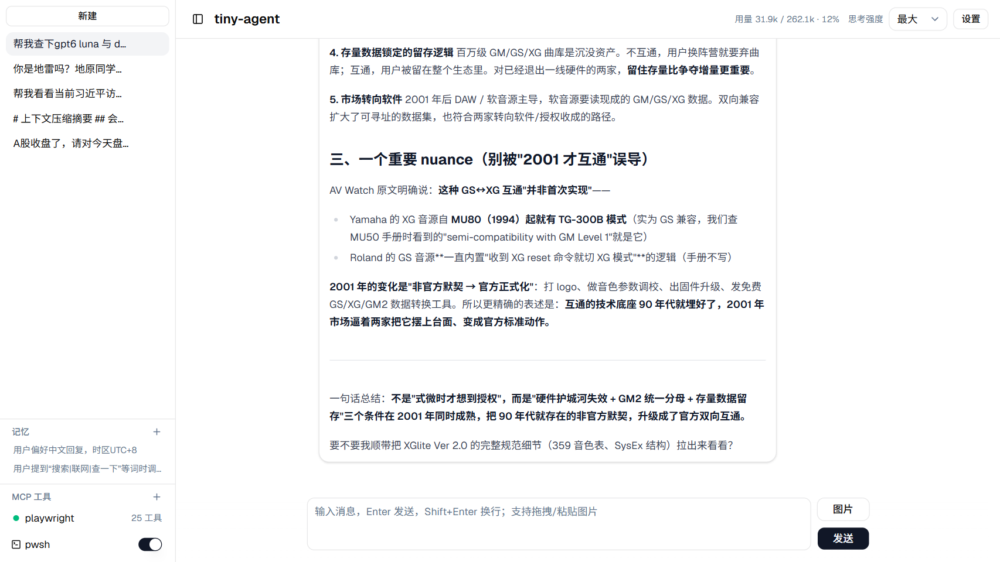
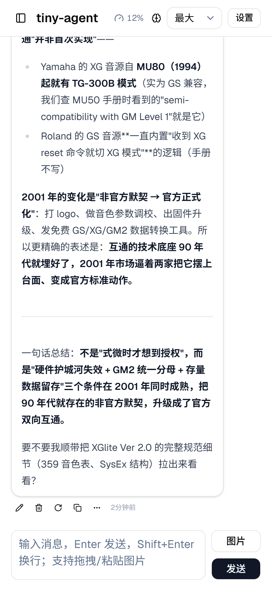

# tiny-agent

本地聊天助手：React 前端 + Express API 服务器，对接任意 OpenAI 兼容上游（如 tabbyAPI / llama.cpp server），支持 MCP 插件扩展工具、本地 TTS 朗读。

> **项目状态**：当前为进行中项目，不是可发布的成熟产品；在目标机器上无法运行属于预期情况。

## 截图

### 桌面版



### 移动版

<p align="center"></p>

## 架构

- **服务器是会话状态的唯一事实源**：浏览器只发指令、收 SSE 事件，刷新/重连不丢状态
- 上游调用 100% 官方 OpenAI SDK（`openai` npm 包），运行在服务器端
- 前端：React 19 + Vite 8 + Tailwind v4 + shadcn（base-ui）
- 服务器：Express 5 + TypeScript（Node 24 原生运行，无需编译）

```
浏览器 ──/api（SSE 流式）──> Express server ──OpenAI SDK──> OpenAI 兼容上游
                                    │
                    ┌───────────────┼───────────────┐
                内置工具          MCP 插件          TTS
              (pwsh/read_image)  (stdio 子进程)   (pwsh 7)
```

```
client/          前端全部（index.html 入口、组件、hooks、vite/tsconfig/shadcn 配置、dist/ 构建产物）
server/          服务器全部（多模块：index 装配 / routes 路由 / generate 生成核心 / sessions 存储 / upstream 上游 / mcp / tools / compact 压缩 / tts / config / memories / types + tts.ps1）
```

运行时数据与源码分离，位于数据目录（见下），安装目录可只读。

## 快速开始

```bash
npm install
npm run dev          # server(3000) + vite(5173)，vite 代理 /api → 3000
```

打开 http://localhost:5173 ，在设置里填上游地址（如 `http://<host>:<port>/v1`）和模型名。

### 数据目录

服务器启动参数 `--data-dir <路径>` 显式指定数据目录，缺省 `./data`（相对进程 cwd）：

```bash
npm run dev -- --data-dir <数据目录路径>         # 完整开发环境（server + vite）
npm run dev:server -- --data-dir <数据目录路径>  # 仅 server
```

数据目录内容：

| 文件/目录 | 说明 |
|---|---|
| `settings.json` | 上游地址、模型、MCP 配置、工具开关（UI 设置页写入） |
| `sessions/` | 会话，每会话一个 JSON 文件 + `_index.json`（当前会话） |
| `memories.json` | 持久记忆，每次生成注入 developer 角色 |
| `workspace/` | 所有工具（pwsh / read_image / MCP 插件）共享工作目录，文件互相可见；`%TEMP%` 重定向到其 `tmp/`（启动时清扫 7 天前文件） |
| `tts.wav` | TTS 缓存（同文本复用） |
| `crash.log` | 未捕获异常/未处理 rejection 日志 |

## 工具

- **pwsh**：在本地执行 PowerShell **7**（`pwsh.exe`；设置页可开关，本机没装 pwsh 7 则调用直接失败）；工作目录 `data/workspace`。脚本正文作为单个 argv 交给 `pwsh -NoLogo -NoProfile -NonInteractive -Command`（不注入任何内容）；输出默认 30s 超时（模型可通过 `timeout` 参数请求，上限 600s）、捕获窗口 1MB 与显示上限 10000 字符均滚动保留末尾；非零退出码在输出首行标 `[退出码 N]`，截断标 `[截断]`，超时被杀标 `[超时]`
- **read_image**：读取本机图片（≤20MB）注入上下文；相对路径基于 `data/workspace`
- **MCP 插件**：设置页配置 `command + args + env`，官方 `@modelcontextprotocol/sdk` stdio 传输；工作目录 `data/workspace`（与内置工具共享，TEMP 重定向到其 `tmp/`）；工具名加 `mcp__<插件>__` 前缀；20s 连接超时（首次 npx 拉包较慢）、30s 工具超时；服务器退出时按进程树清理（Windows `taskkill /T`）

## TTS

设置页开启后，朗读按钮调用 `POST /api/tts`：pwsh 7 + SAPI 5（`System.Speech`）合成 wav 流式返回。

- 依赖：PowerShell 7（`System.Speech` 10 才有 `SetOutputToWaveFile`）+ Windows SAPI 5
- 音色：优先选择本机已安装的 `Microsoft Xiaoxiao`（排除 Online 版本）；未安装则回退系统默认音色——不假设目标机器装有 Xiaoxiao 神经语音包

## 脚本

| 脚本 | 说明 |
|---|---|
| `npm run dev` | server + vite 并行（开发）（`-- --data-dir <路径>` 可传数据目录） |
| `npm run dev:server` | 仅 server（`-- --data-dir <路径>` 可传数据目录） |
| `npm run dev:vite` | 仅 vite |
| `npm run build` | 类型检查 + vite 构建 → `client/dist/` |
| `npm start` | 生产模式：仅 API 服务器（端口 3000）；前端静态资产（`client/dist/`）由 nginx/CDN 托管 |

## 独立运行

> 注意：当前非成熟产品，此流程仅在本机验证过；目标机器上无法运行属于预期情况。

```bash
npm run build        # 产出 client/dist/（生产静态前端）
npm start            # 仅 API 服务器（端口 3000）；或 npm start -- --data-dir <路径>
```

`client/dist/` 是生产静态前端，由 nginx/CDN 等托管；前端 `/api` 请求指向 Node API 服务器（3000）。数据落在 `--data-dir` 指定位置（缺省 `./data`）。